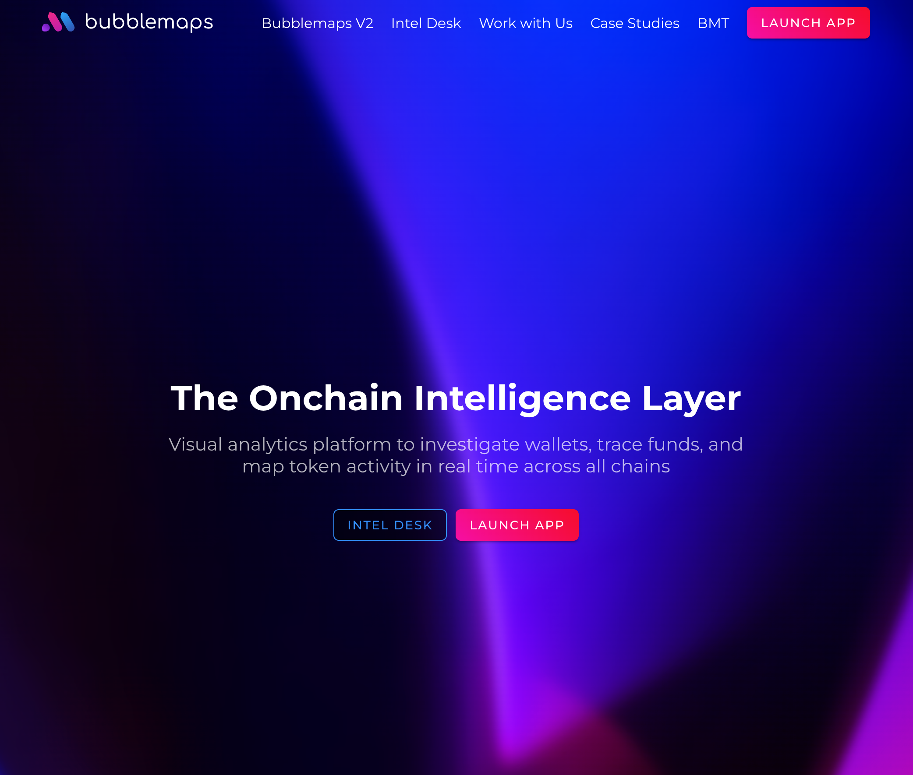
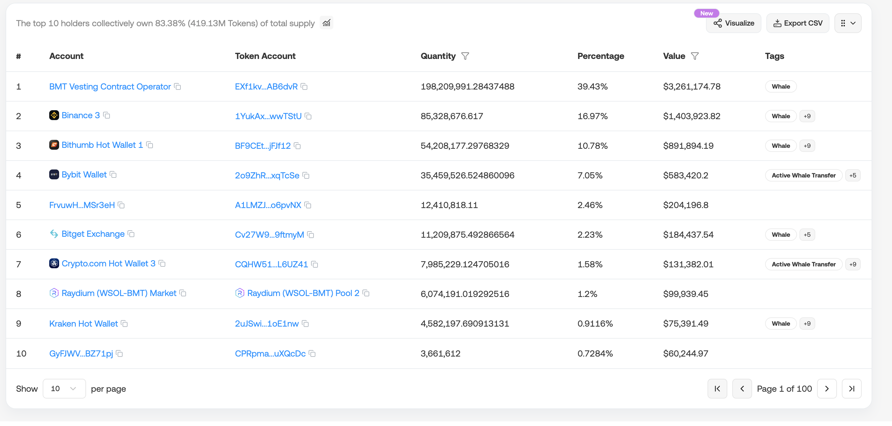
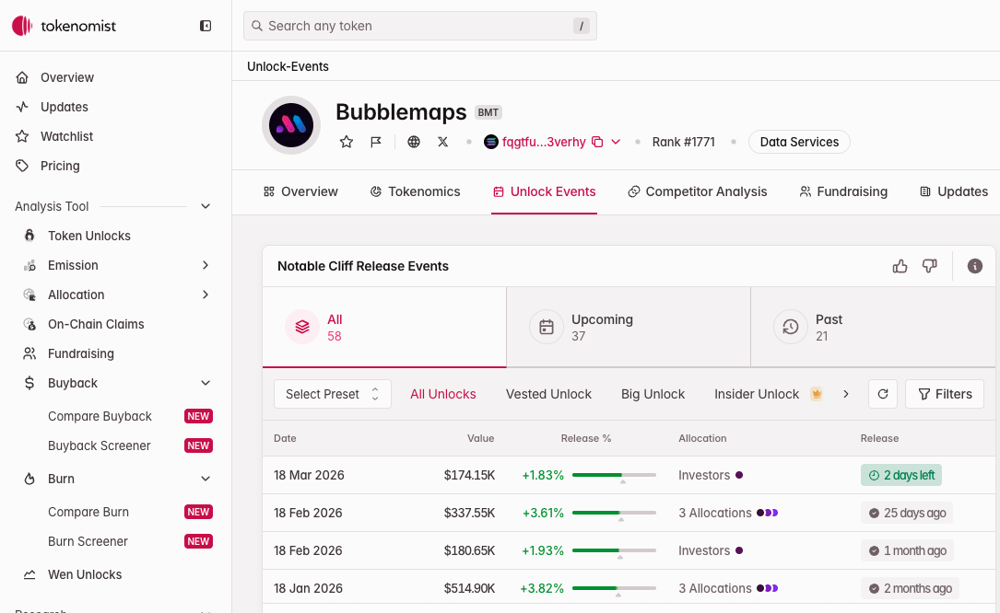
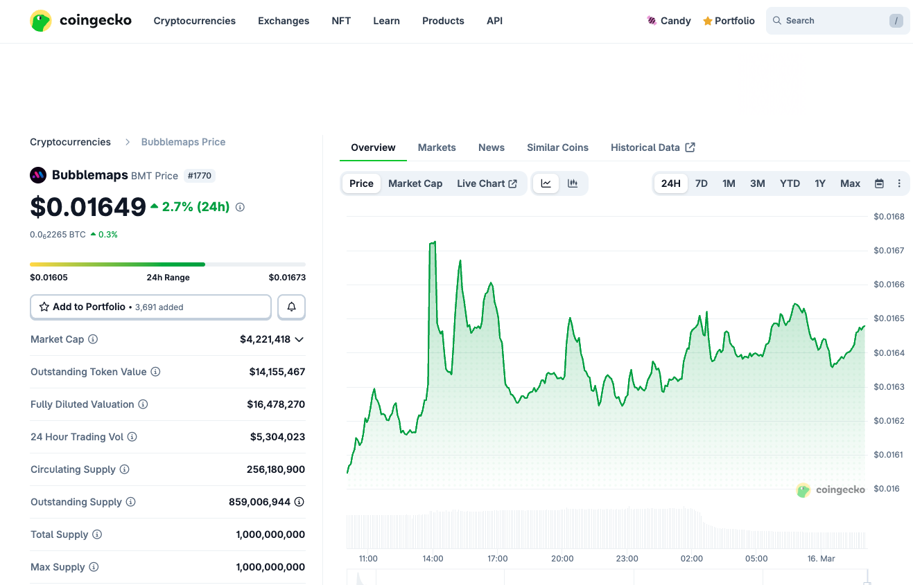
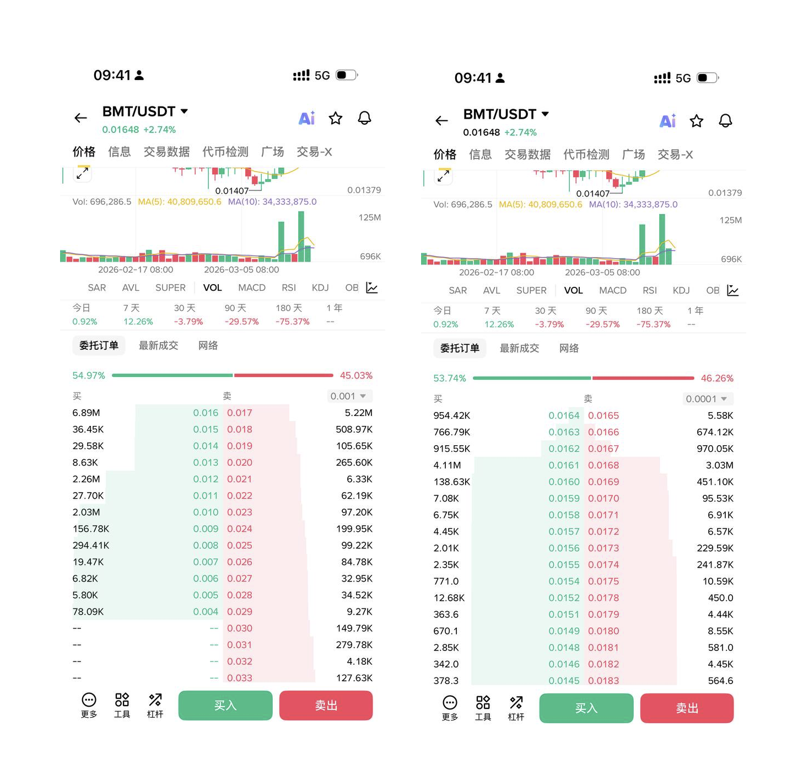

+++
title="用链上数据拆解一个做链上数据的项目——BMT (Bubblemaps) "
date="2026-03-16"
+++

朋友丢了个合约地址过来，说他刚投了一万美元。

`FQgtfugBdpFN7PZ6NdPrZpVLDBrPGxXesi4gVu3vErhY`

我看了一眼，Solana 上的代币，叫 BMT。全称 Bubblemaps。

他想吃 10-20 个点的反弹就走。我没评价操作本身，但作为一个写过链上监控脚本的人，我决定花一个下午把这个项目翻个底朝天。

有意思的是——BMT 自己就是做链上分析的平台。官网写得很清楚：

> Visual analytics platform to investigate wallets, trace funds, and map token activity in real time across all chains

用链上数据分析工具去分析一个做链上数据分析的项目，这事本身就挺讽刺的。

## 先看基本面

BMT 的母公司 Bubblemaps 做的事情不复杂：把链上钱包的关联关系做成可视化气泡图，帮你识别哪些地址属于同一个实体。支持多链，界面做得确实不错。他们还有一个 [intel.bubblemaps.io](https://intel.bubblemaps.io/?tab=closed-cases) 页面，收集了不少 Web3 项目的调查案例，算是行业里比较有辨识度的产品。

融资方面，翻了一下公开信息（[来源：Binance Research](https://www.binance.com/zh-CN/research/projects/bubblemaps)）：

- 在币安钱包做过 IDO，筹了 800 万美元，4% 的供应量以 $0.020 的价格卖出
- 另外做过一轮股权融资加三轮币权融资，总共筹了 610 万美元
- 币权融资的价格分别是 $0.0558、$0.020、$0.030、$0.035

也就是说，如果你现在以市场价买入 BMT，你的成本跟早期投资者差不多，甚至更低。这听起来像好事，但反过来想——早期投资者的解锁压力，正好也落在你头上。

## 筹码在谁手里

这是我最想搞清楚的部分。

打开 [Solscan 的 Holders 页面](https://solscan.io/token/FQgtfugBdpFN7PZ6NdPrZpVLDBrPGxXesi4gVu3vErhY#holders)，前几名持仓地址里，能辨认出的有币安热钱包、Raydium 的 LP 池。但也有几个大额地址身份不明。

总供应量 10 亿枚 BMT。流通量这个数字比较有争议——[CoinMarketCap](https://coinmarketcap.com/currencies/bubblemaps/) 算出约 6.1 亿枚（61%），而 [Tokenomist](https://www.tokenomist.ai/bubblemaps) 只算 2.56 亿枚（25.62%）。差这么多，是因为"流通"的定义不同：有些已解锁但还躺在项目方或生态基金钱包里的代币，CoinMarketCap 算进去了，Tokenomist 没算。

不管用哪个口径，锁仓部分的去向才是重点。

根据 [Bubblemaps 官方 Wiki](https://wiki.bubblemaps.io/bmt/tokenomics) 公布的代币经济学模型：

| 类别 | 占比 | 数量 | TGE 释放 | 锁定期 | 线性释放 | 网络|
|------|------|------|----------|--------|----------|----------|
| 空投 | 22.17% | 2.217 亿 | 32.34% | 无 | 12 个月 |Solana|
| 生态 | 21.30% | 2.130 亿 | 4.69% | 无 | 36 个月 |BNB Chain|
| 投资者 | 19.35% | 1.935 亿 | 2.23% | 2-6 个月 | 10-20 个月 |Solana|
| 流动性 | 12.18% | 1.218 亿 | 55.83% | 无 | 6 个月 |BNB Chain / Solana|
| 团队 | 9.00% | 0.900 亿 | 0% | 12 个月 | 36 个月 |BNB Chain|
| 协议开发 | 6.00% | 0.600 亿 | 0% | 6 个月 | 36 个月 |BNB Chain|
| 币安 IDO | 4.00% | 0.400 亿 | 100% | - | - |BNB Chain|
| 币安 HODLer 空投 | 3.00% | 0.300 亿 | 100% | - | - |BNB Chain|
| 币安市场推广 | 3.00% | 0.300 亿 | 100% | - | - |BNB Chain|

这张表里有几个数字值得盯着看，下面展开说。

## 团队解锁：链上可验证的事实

这不是小道消息，是写在合约里的。

BMT 的 TGE（Token Generation Event）发生在 2025 年 3 月 11 日。根据官方 Wiki 的代币经济学文档，团队份额的设定是：**0% TGE 释放 + 12 个月锁定期 + 36 个月线性释放**。

12 个月锁定期意味着 cliff 到期日是 **2026 年 3 月 11 日**——也就是 5 天前。

从 3 月 11 日起，9000 万枚团队代币开始按日线性释放，每天大约释放 9000 万 / 1095 天 ≈ **82,192 枚**，按当前价格约合 **$1,350/天**。

这个数量级在当前盘面下的冲击有限，但它是持续性的。36 个月，每天都在释放，不会停。

链上验证方式：Solana 上的 vesting 合约地址是 `vestjSC1M4SeKKKWroYprGfdcv2mrK8CH1xVEuwhDb1`，你可以在 [Solana Explorer](https://explorer.solana.com/address/vestjSC1M4SeKKKWroYprGfdcv2mrK8CH1xVEuwhDb1) 上直接查看这个合约的交互记录，确认解锁是否已经开始执行。

另外，[Tokenomist](https://tokenomist.ai/bubblemaps/unlock-events) 显示 3 月 18 日还有一批 **1060 万枚**的空投类别解锁，价值约 $17.4 万。这两个叠加在一起，短期抛压不能忽视。

## 流动性有多薄

这才是我真正担心的地方。

截至 2026 年 3 月 16 日的市场数据（来源：[CoinGecko](https://www.coingecko.com/en/coins/bubblemaps) / [CoinMarketCap](https://coinmarketcap.com/currencies/bubblemaps/)）：

- 价格：约 $0.01648
- 24 小时成交额：约 $500 万（CoinMarketCap 报 $480 万，但是币安交易所 显示只有 64 万）
- 流通市值：$420 万（CoinGecko 口径）或 $1000 万（CoinMarketCap 口径）
  

DEX 端交易主要集中在 Raydium，CEX 端在币安，另外 Bybit、Bithumb、Bitget 也有一些量。

我直接打开了币安 BMT/USDT 的盘口，看到的情况比我想的更有意思。

买卖比 54:46，看起来买盘略占上风。但拆开看深度结构，完全是另一回事。

**先看头顶上的天花板。** 从当前价格往上，$0.0168 挂着 303 万枚卖单（约 $5.1 万），$0.017 整数位累计约 522 万枚（约 $8.9 万）。要吃穿 $0.017 这道墙，大概需要 $8.9 万的买盘。再往上到 $0.018 还有 50.9 万枚（约 $9,200），$0.020 有 26.6 万枚（约 $5,300）。也就是说，从当前价格拉到 $0.020（涨 21%），累计需要吃掉约 $10.5 万的卖单。

**再看脚下的地板。** $0.0161 有 411 万枚买单（约 $6.6 万），$0.016 整数位累计约 689 万枚（约 $11 万）。这两道买墙合计约 $17.6 万，看起来挺厚。

但问题在 $0.016 下面。从 $0.015 到 $0.013，买盘断崖式下降——$0.015 只有 3.6 万枚（$547），$0.014 只有 3 万枚（$414）。几乎是真空。下一个有意义的买墙在 $0.012，有 226 万枚（约 $2.7 万）。

翻译成人话就是：价格被夹在 $0.016 和 $0.017 之间的窄幅区间里。$0.016 的买墙看着结实，但一旦被砸穿，下面到 $0.012 几乎没有承接，直接跌 27%。

这对我朋友意味着什么？他的 1 万美元要赚 10%，需要价格突破 $0.017 的 $8.9 万卖墙，这在日成交 $300 万的盘面里不是不可能，但需要持续的买盘推动。而如果 $0.016 的支撑被击穿，他会直接面对 25%+ 的回撤，因为中间根本没人接。

上有顶，下无底。这就是小市值币种的流动性现实。

## 跨链的信号

根据 [Bubblemaps 官方 Wiki 的 Cross Chain 页面](https://wiki.bubblemaps.io/bmt/cross-chain)，BMT 用了 LayerZero 的 OFT（Omnichain Fungible Token）标准，支持 Solana 和 BNB Chain 之间的跨链转移。机制是：源链 burn，LayerZero 中继消息，目标链 mint，全程不需要包装资产。

对应的链上合约地址：

- Solana OFT Program:`BCE3naS4LHAfGeiN34dTTR42vBcKMC8tafF8SBDTAD5c`（[Solana Explorer](https://explorer.solana.com/address/BCE3naS4LHAfGeiN34dTTR42vBcKMC8tafF8SBDTAD5c)）
- BNB Chain OFT Token:`0x7d814b9ed370ec0a502edc3267393bf62d891b62`（[BscScan](https://bscscan.com/address/0x7d814b9ed370ec0a502edc3267393bf62d891b62)）

这个细节散户一般不会注意，但对判断资金流向有参考价值。

一个常见的套利模式是：在链上 DEX 买入低价筹码，跨链到 CEX 卖出赚差价。如果你在 OFT 合约上观察到 Solana → BNB Chain 方向的大额 burn 交易突然变多，值得警惕——这可能意味着有人在搬砖出货。当然，也可能只是正常的跨链需求，需要结合 CEX 端的卖盘变化一起看才能下判断。

## 关于 mint 权限

还有一个容易被忽略的点。

在 [Solana Explorer](https://explorer.solana.com/address/9xNEePFZEiSW4V8UMpg2JHREw6pJBM1ZHc8qkWvQK8Ys/tokens) 上可以查到，BMT 的 mint authority 仍然存在。这意味着理论上还可以增发。当然这不代表项目方一定会增发，但这个权限没有被销毁，本身就是一个需要留意的风险点。

## 算一笔账

我朋友的计划是吃 10-20% 的反弹。结合上面的盘口数据推演一下：

他以均价 $0.0167 买入，1 万美元大约持有 60 万枚 BMT。

想赚 10%，价格要到 $0.0184。从当前价格到那里，要先吃穿 $0.017 的 522 万枚卖墙（~$8.9 万），再穿过 $0.018 的 50.9 万枚（~$9,200）。需要大概 $10 万的净买盘才能推到位。以当前日成交 $300 万来看，不是不可能，但得有持续的资金流入。假设涨到了，他卖出 60 万枚的滑点在这个深度下大概 1-2%，实际到手约 $800-900。

想赚 20%，价格要到 $0.020。$0.020 还挂着 26.6 万枚卖单。这就更难了。

而亏的那一面：$0.016 的买墙有 $11 万，看着挺厚。但如果被砸穿（比如团队解锁的代币陆续流入市场），从 $0.016 到 $0.012 之间几乎是真空，他的浮亏会瞬间从 -4% 变成 -28%。

赚 10% 需要 $10 万买盘推动，亏 28% 只需要 $11 万卖盘砸穿一道墙。这就是实际的风险收益比。

## 一些可以自己验证的事

如果你也在关注 BMT 或者类似的小市值代币，这几个维度可以自己去查：

1. 价格回到 $0.016 附近时，币安上的成交量有没有放大。无量上涨大概率是诱多。
2. [Solscan](https://solscan.io/token/FQgtfugBdpFN7PZ6NdPrZpVLDBrPGxXesi4gVu3vErhY#holders) 上持仓变化。前 20 名地址最近一周有没有在减持。
3. 跨链桥的方向。是从 DEX 往 CEX 搬，还是反过来。
4. [Tokenomist](https://tokenomist.ai/bubblemaps/unlock-events?preset=default-vested_unlock) 上的解锁日程表，看最近一个月有没有大额解锁事件。
5. Solana 上 vesting 合约 `vestjSC1M4SeKKKWroYprGfdcv2mrK8CH1xVEuwhDb1` 的最新交互，确认团队代币是否已经开始被 claim。

## 最后

BMT 是一个工具型代币。Bubblemaps 的产品确实有用——我自己分析项目的时候也会用它来看钱包关联。但产品有用和代币值得买是两回事。

当前这个价格区间，流通市值几百万到一千万（看你信哪个数据源），团队解锁刚刚开始，3 月 18 日还有一笔空投解锁。短线反弹的动能有，但抛压也在同步累积。

我没告诉朋友该不该跑。我只是把数据摆给他看了。

至于他怎么决定——这不是数学能回答的。

---

**数据来源：**
- 代币经济学官方文档：[Bubblemaps Wiki - Tokenomics](https://wiki.bubblemaps.io/bmt/tokenomics)
- Token 合约：[Solscan](https://solscan.io/token/FQgtfugBdpFN7PZ6NdPrZpVLDBrPGxXesi4gVu3vErhY)
- Token 详情：[Solana Explorer](https://explorer.solana.com/address/FQgtfugBdpFN7PZ6NdPrZpVLDBrPGxXesi4gVu3vErhY)
- Vesting 合约：[Solana Explorer](https://explorer.solana.com/address/vestjSC1M4SeKKKWroYprGfdcv2mrK8CH1xVEuwhDb1)
- 融资信息：[Binance Research - Bubblemaps](https://www.binance.com/zh-CN/research/projects/bubblemaps)
- 解锁日程与流通量：[Tokenomist](https://www.tokenomist.ai/bubblemaps)
- 解锁事件明细：[Tokenomist - Unlock Events](https://tokenomist.ai/bubblemaps/unlock-events?preset=default-vested_unlock)
- 行情数据：[CoinGecko](https://www.coingecko.com/en/coins/bubblemaps) / [CoinMarketCap](https://coinmarketcap.com/currencies/bubblemaps/)
- 转账记录：[Solscan - 跨链合约](https://solscan.io/account/8XygGv7qQsyfZXY3Eov1Gz5wxuzciVWHMaQhdHN5GhsA?token_address=FQgtfugBdpFN7PZ6NdPrZpVLDBrPGxXesi4gVu3vErhY#transfers)
- Mint 权限：[Solana Explorer](https://explorer.solana.com/address/9xNEePFZEiSW4V8UMpg2JHREw6pJBM1ZHc8qkWvQK8Ys/tokens)
- 调查案例库：[Bubblemaps Intel](https://intel.bubblemaps.io/?tab=closed-cases)
- 官网：[bubblemaps.io](https://bubblemaps.io/)
- 推特：[x.com/bubblemaps](https://x.com/bubblemaps)
